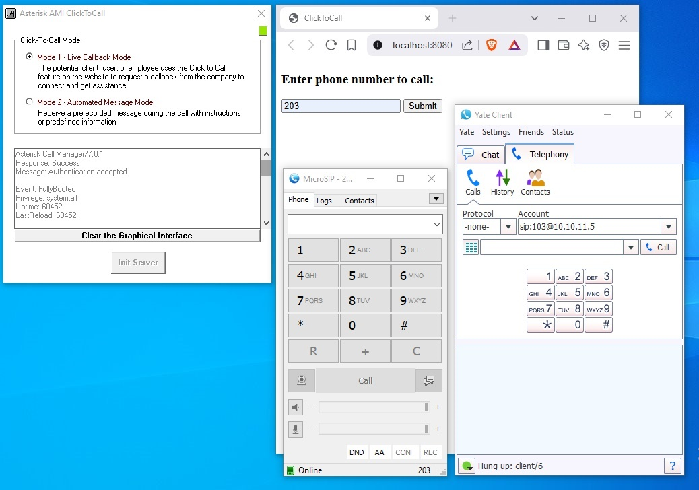

# Asterisk-AMI-ClickToCall - TwinBASIC/VB6
A lightweight Click-to-Call solution for Asterisk PBX, built with TwinBASIC/VB6.

This application enables web-based click-to-call functionality, allowing users to initiate phone calls directly from a web interface.

 <!-- Add a screenshot/GIF later -->

## Features
Web-based Click-to-Call integration with Asterisk PBX

Lightweight and minimalistic design

Compatible with TwinBASIC and legacy VB6 environments

Simple configuration for quick deployment

Basic status monitoring

## Prerequisites
**Asterisk PBX system** (FreePBX 16 with Asterisk 13/16/18) **OR** [Use our pre-configured demo environment, FreePBX16 Ast18](#demo-environment-setup):

**TwinBASIC compiler or VB6 IDE**

## Demo Environment Setup
**Quickstart for testing** 🚀
*Do it yourself - DIY!*

1.  **Use our ready-to-deploy Proxmox virtualized Asterisk systems:**
    *Virtualize Your PBX with the PROXMOX Datacenter!*
    
    Download Proxmox Datacenter Backups:
    
    Demo1: [Primary VM - FreePBX16 Asterisk18](https://drive.google.com/drive/folders/1vYheZXc9nzD32NDR6MrIh09tyoSy1Y9K?usp=sharing):

    Demo2: [Secondary VM - FreePBX16 Asterisk18](https://drive.google.com/file/d/1N4D0CtDb_qLN8e0odDNO65q1-WD6hjfP/view?usp=sharing):

    *NOTE: Proxmox Backups for VM Deployment*
    
    These backups deploy VMs within the 10.10.11.0/24 network segment.

    For proper functionality of the interconnected Asterisk systems via trunk links, configure the IP addresses as follows:

    Primary VM (Demo1): Assign static IP 10.10.11.5

    (This VM will later host the Asterisk-AMI-ClickToCall demo)

    Secondary VM (Demo2): Assign static IP 10.10.11.13
   

    *Additional Configuration Details:*

    Each Asterisk PBX system has over 50 pre-configured extensions, 40 Trunk Channel.
    
    Demo1 includes a fully configured Call Center with all functionalities required to operate any of the planned demos.

    Interconnected Systems: You’ll get two fully programmed Asterisk systems that are interconnected.
    

    *My Proxmox Setup Demo:*
    I’m running a Proxmox datacenter on an old ASUS laptop (2015 model: X551CA Celeron, 1.5 GHz, 4 GB RAM, 500 GB HDD).

    This setup    easily handles 1-2 VMs at a time.

    
2.  **Backups to Configure Your FreePBX16 + Asterisk18 Setup**
    If you set up your own Asterisk installation with FreePBX16 + Asterisk18, here is a backup file to restore the preconfigured settings required for the demo.
    
    *Download FreePBX16 Backups:*
    
    Demo1: [Backup Setup FreePBX16 Asterisk18 - Demo1 (Primary)](https://drive.google.com/file/d/1zEy-Fo26Rd-rG2NW2cEaTR2Ul6N6WpwL/view?usp=sharing)
    
    Demo2: [Backup Setup FreePBX16 Asterisk18 - Demo2 (Secondary)](https://drive.google.com/file/d/1cHjZ4PL-biWW3217TETCNDdGi2wSdmwt/view?usp=sharing)

3.  **Use our ready-to-deploy Asterisk PBX in a Raspberry Pi:**
    *Your PBX in a Raspberry Pi!*
    
    Download PiPOS PBX Backups:
    
    Demo1: [Primary PiPOS PBX Backups](https://drive.google.com/drive/folders/???):

**Virtualizing Asterisk:** I recommend deploying Asterisk in a virtualized environment. For this, Proxmox is a solid and efficient solution.

Backup Links: Use the links above to download Asterisk backups for your own setup, or download the Proxmox backup to get a pre-configured Asterisk system (just like the one in our demo videos).

**To access Asterisk:**

Open a web browser.

Enter your Asterisk server’s IP address (or the VM IP where Asterisk is running).

login = admin, Password = admin.

SSH: root/PiPOSOverallroot

**DIY! - DO IT YOURSELF!**

[How to Configure the Demo](https://drive.google.com/file/d/1v4sGf8kRSnP3Nu8SmZDS0qMfFtQTa_bK/view?usp=sharing)

**See how it works:** Share on YouTube:

[DataCrossMachine #1 (SupraDialer)](https://youtu.be/7CoqcAWqgRg)

[Real-Time Demo (SupraDialer within an Ecosystem) "Queue" Mode (Outbound Call Center Campaign):](https://youtu.be/BCe3zEsb5nQ)

**How to connect DataCrossMachine #1 to your current business environment with Asterisk**
For Commercial: Get the Product Installer and license, "Connect Data, Drive Results"!

**Want to Deploy DataCrossMachine in Your Own Cloud?**
Why not?

**Support:**
Report any issues—I’ll handle them! 🛠️

## Installation
Clone or download this repository

Configure AsteriskAMIClickToCall.ini (or appropriate configuration file) with your Asterisk server details

Compile the application using TwinBASIC/VB6 IDE (or use pre-built binaries)

Deploy the web interface files to your web server

Configure Asterisk to handle the click-to-call requests

[asterisk]
server = your.asterisk.server
port = 5038
username = adminag
password = PiPOSOverallroot

## Usage
Access the web interface at http://localhost:8080/ or http://your-server/8080

Enter the phone number you wish to call

Click the call button

The system will initiate a call between the agent and the customer

## Building from Source
Open the project in TwinBASIC or VB6 IDE

Review and modify any configuration constants as needed

Compile the application to generate executables

## Contributing
Contributions are welcome! Please fork the repository and submit pull requests for any improvements or bug fixes.

📜 License Model
This project operates under a dual-license framework:

1. Open-Source License (AGPLv3)
    
    •	📌 Free to use, modify, and distribute
    
    •	🔓 Source code must remain open if used in networked/web services (via GNU Affero GPL v3)
    
    •	🔄 Derivative works must be shared under the same license
            
    •	⚖️ Ideal for testing/demo environments

    Applies to: Community Edition (this repository)
    
    
2. Commercial License

    •	💼 For proprietary/commercial use (no AGPL restrictions)
    
    •	🛡️ Includes legal protection & technical support
    
    •	🚀 Access to advanced features (Windows integrations, enhanced security, etc.)
    
    •	📦 No obligation to share modifications
    
    Applies to: Premium/Enterprise Editions

3. Comparison Table
    
    | Feature                   | AGPLv3 (Community)                 | Commercial License                |
    |---------------------------|-------------------------------------|------------------------------------|
    | **Modifications**         | Must be shared publicly             | Keep private                      |
    | **Closed-Source Windows Apps** | Allowed*                    | Allowed (no restrictions)         |
    | **Technical Support**     | Community-driven                   | Priority & guaranteed SLAs        |
    | **Redistribution Rights** | Viral license (derivatives must be AGPLv3) | Full discretion (no sharing required) |
    | **Premium Features**      | Basic functionality only           | [Premium Features Here]**          |
    | **Pricing**               | Free                                | Contact for enterprise pricing    |

    **Notes**:  
    - **\*** Using AGPLv3 code in closed-source Windows apps requires:  
    - Sharing all modifications to the original code under AGPLv3.  
    - Your app's core logic can remain closed, but any modified parts of *our code* must stay open.  
    - **\*\*** Get more premium features with Commercial License: "CRM Integrations", etc.  

________________________________________
📝 How to License

For production use or closed-source projects:

    🔒 Contact lfeche@hotmail.com to discuss commercial licensing options.

________________________________________
⚠️ License Clarifications

**Testing & Development**

Demo/Asterisk testing:

✅ AGPLv3 covers all testing scenarios (no commercial license needed).

**Proprietary Windows Apps**

Using AGPLv3 Code:

🔄 You must share modifications to our original code under AGPLv3.

🔒 Your app’s proprietary logic/code can remain closed.

**Commercial License Required If:**

🚫 You want to keep all modifications private.

🚫 Distributing closed-source apps with our code integrated.

A commercial license is required to keep modifications private.

**Exceptions & Special Cases**

Educational/Non-Profit Use: Contact us for tailored solutions.

________________________________________
📜 Full Legal Text

    •	Open-source license: AGPLv3 LICENSE FILE

    •	Commercial terms: Available upon request.

________________________________________
Why This Model?

    ✅ Encourages community adoption while protecting commercial interests

    ✅ Complies with open-source ethics

    ✅ Clear path for users to transition from demo to paid

## Disclaimer
This software is provided as-is without warranties. Use at your own risk. Ensure proper testing before deployment in production environments.
